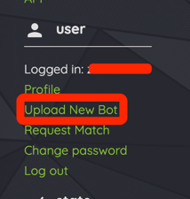
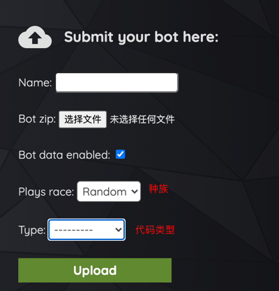
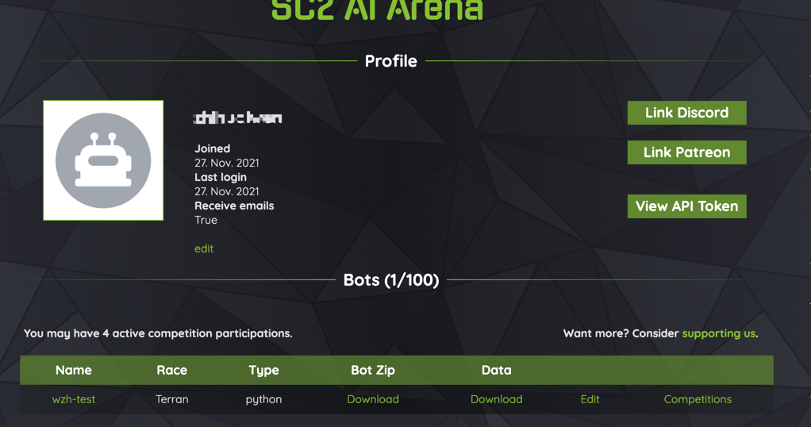
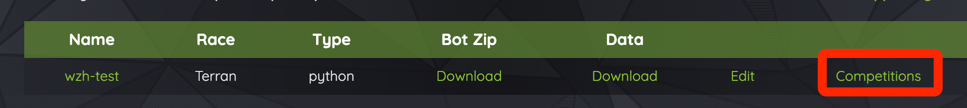
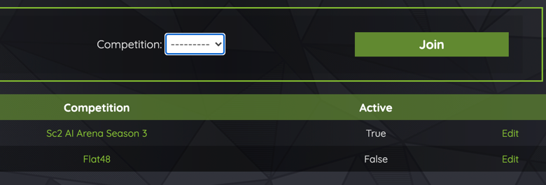
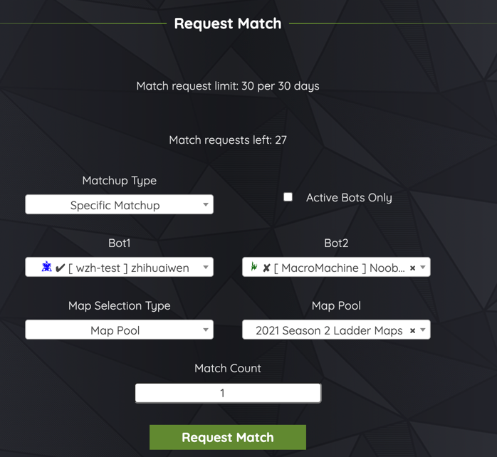
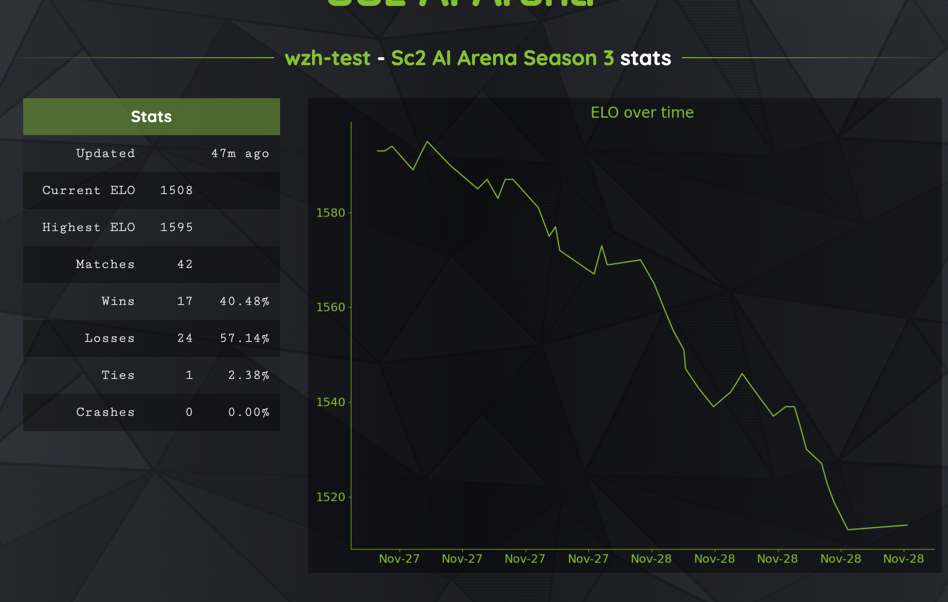

# StarCraft Ⅱ 人工智能教程

非深度学习人士，仅仅是兴趣驱动，可能有很多不对的地方，也欢迎大家指正。这里主要讲解如何将AI运行起来、机器人对战、人机对战、天梯上分等等，希望能对大家的人工智能工程道路上有所帮助。

捐赠：  

# 一、其他的太抽象了，先讲人机对战吧
sc2的[wiki](https://sc2ai.net/wiki/human-vs-bot/)资料很全，可以从这里下载并运行，目前人机对战只能在win下运行，这边特别强调一下的就是，需要以管理员身份运行，下面详细过程，翻译自 [ProBots 2021 Season 1 - Human vs Bot](https://community.eschamp.com/t/probots-2021-season-1-human-vs-bot/256)。   

1.安装星际争霸2，[地址](https://sc2.blizzard.cn/landing)，至于要不要下载国际服，似乎没有必要  
2.下载[ProBots vs Humans.Zip](https://www.dropbox.com/s/9ffo2zjxi61dk5a/ProBots%20vs%20Humans_2021_S1.zip?dl=0)  
3.解压，附带了地图，主要是sc2aiapp  
  

4.可选，下载相关地图，可以从[竞技场](https://sc2ai.net/wiki/maps/)里下，需要放到星际争霸2的目录下，mac的是/Applications/StarCraft II/Maps  
5.打开步骤2的目录  
6.打开sc2aiapp，打开的时候有可能报错：  

右键sc2aiapp，以管理员身份运行即可，现在不让注册了，直接continue without login

  

  

7.全屏快捷键，Alt + Enter，进行对战

# 二、AI天梯
目前没有看到什么办法让暴雪允许AI在实际的天梯上进行运行，但社区搞了个专门的AI天梯，[sc2ai](https://sc2ai.net/)，可以将代码上传到里面进行对战，实时流我没看到，对战完后可以下载replay复盘。下面讲下如何上传代码进行对战。
1.第一步肯定是先要注册登录  
2.upload new bot  
  

3.主要是这个Bot zip，基本的代码架构还是要固定的 

  

具体可以看下sc2-api-simple-bot这里，记得把它打包即可    
4.成功之后，即可从profile里看到自己的机器人  
  
5.此时，bot是不会进行比赛，需要参赛，点击Competitions，然后选择赛季  
  
  
6.比赛是随机的放到队列里的，可能需要排队进行比赛，也可能主动申请和具体的机器人进行比赛，点击Request Match，进行申请比赛。  
  
7.慢慢等待，比赛结束之前都看不到结果的，也没有实时流进行查看的，结束之后就可以看到结果以及下载replay。其中arena会随机的进行一些比赛，也有可能是别人随机选的，一个bot一天大概能有50场比赛，arena也会提供统计，胜率、ELO（分数）等  
  

