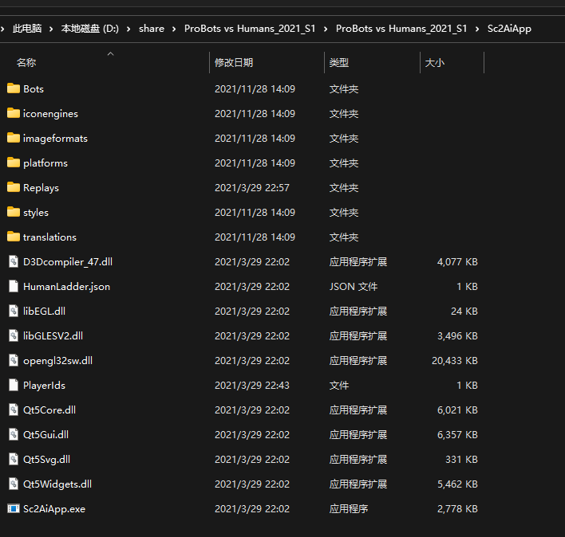
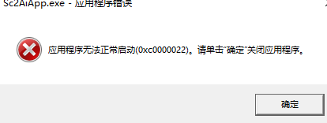
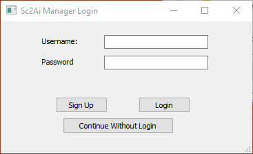
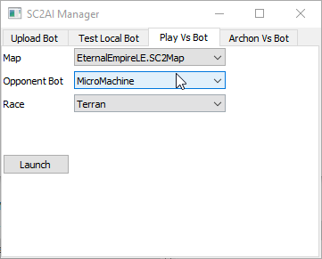

# StarCraft Ⅱ 人工智能教程

# 一、其他的太抽象了，先讲人机对战吧
sc2的[wiki](https://sc2ai.net/wiki/human-vs-bot/)资料很全，可以从这里下载并运行，目前人机对战只能在win下运行，这边特别强调一下的就是，需要以管理员身份运行。

下面详细过程，翻译自[ProBots 2021 Season 1 - Human vs Bot](https://community.eschamp.com/t/probots-2021-season-1-human-vs-bot/256)
1.安装星际争霸2，[地址](https://sc2.blizzard.cn/landing)，至于要不要下载国际服，似乎没有必要  
2.下载[ProBots vs Humans.Zip](https://www.dropbox.com/s/9ffo2zjxi61dk5a/ProBots%20vs%20Humans_2021_S1.zip?dl=0)  
3.解压，附带了地图，主要是sc2aiapp  
  

4.可选，下载相关地图，可以从[竞技场](https://sc2ai.net/wiki/maps/)里下，需要放到星际争霸2的目录下，mac的是/Applications/StarCraft II/Maps  
5.打开目录 
6.打开sc2aiapp，打开的时候有可能报错：  

右键sc2aiapp，以管理员身份运行即可，现在不让注册了，直接continue without login

  

  

7.全屏快捷键，Alt + Enter

# 二、AI天梯
